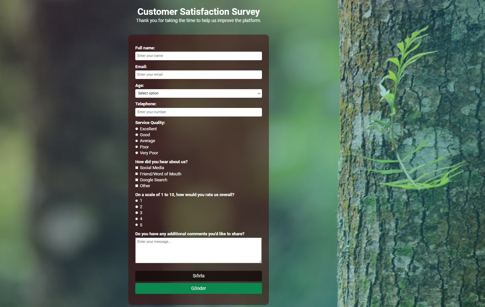

# Customer Survey Form

This project is a customer survey form design web project page. The project was developed using HTML and CSS and published using GitHub.

Contents

- [Project URL](#project-urls)
- [Features](#features)
- [Project Content](#project-content)
- [Screenshot](#screenshot)
- [Challenge](#challenge)
- [Author](#author)
- [License](#license)
- [Show-Your-Support](#show-your-support)

# Project URL

The project is published at: [Blog preview card](https://mkalkandev.github.io/Customer-Survey-Form
/)

# Features
- **Responsive Design: **Provides a good user experience on all devices.

- **Simple and User Friendly Interface:** Provides easy access to recipe information.

- **Modern HTML and CSS Techniques:** Clean and maintainable code structure.

# Project Content

This project contains the following files and folders:

- **index.html:** HTML file for the home page.

- **style.css:** CSS file that creates the design of the project.

# Screenshot

# Challenge

My application allows users to:

See the navigation states of all interactive elements on the page
Continuing development
This was my third form project with HTML and CSS and I am happy with the result. This time I tried to learn new things, so I tried to structure HTML better, introduced flexbox and pseudo-classes on the CSS side. I also implemented the new reset.css. I will continue.

I plan to continue exploring this technology and learning more, so there will definitely be more projects related to this soon.

# Author

👤 MustafaKalkan

Github:<a href="https://github.com/mkalkandev/" target="_blank">@mkalkandev</a>

Frontend Mentor:<a href="https://www.frontendmentor.io/profile/mkalkandev" target="_blank">@mkalkandev</a>

# License

📝 Copyright © 2024 MustafaKalkan.

This project is licensed under the [MIT](./LICENSE) license.

# Show your support

If this project helped you, give it a ⭐️! Have fun building it! 🚀
